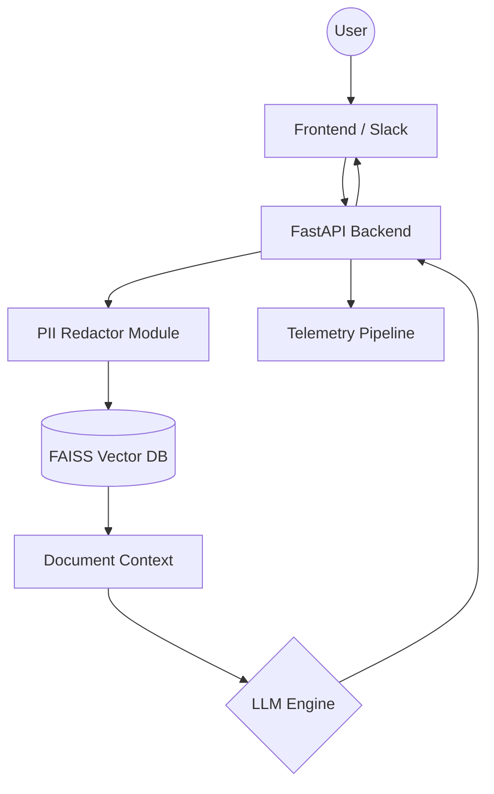

# Architecture Documentation

## System Overview

[cite_start]This project implements a Retrieval-Augmented Generation (RAG) architecture designed for local reproduction and pilot testing[cite: 2, 80].

## Component Diagram

[cite_start]The diagram below illustrates the data flow from the user to the LLM and the telemetry system[cite: 6, 126, 132].

