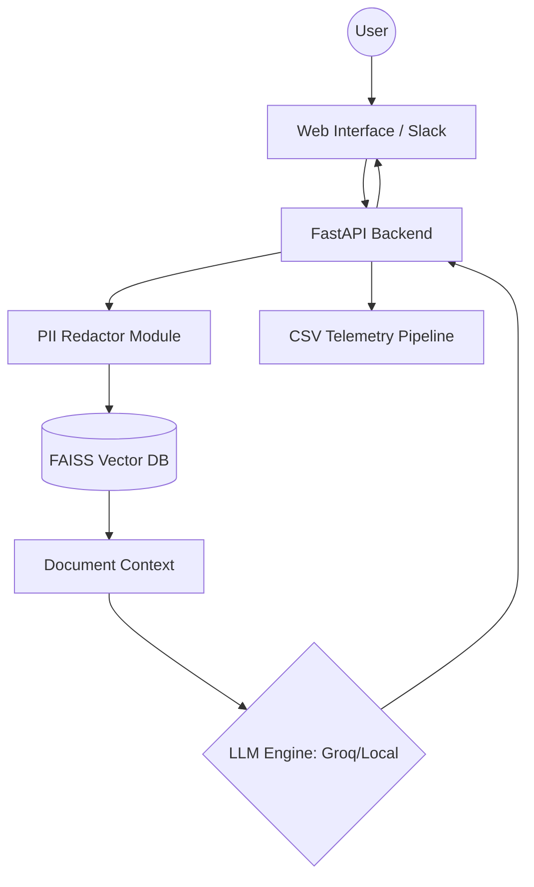

# Architecture Documentation

## System Overview

[cite_start]This project implements a Retrieval-Augmented Generation (RAG) architecture optimized for local execution on macOS Big Sur (11.7.10) using PyTorch 2.2.2[cite: 2, 12, 80, 121].

## Component Diagram

[cite_start]The flow ensures that data remains local, using FAISS for retrieval and a modular adapter for the LLM engine[cite: 114, 122, 126].

